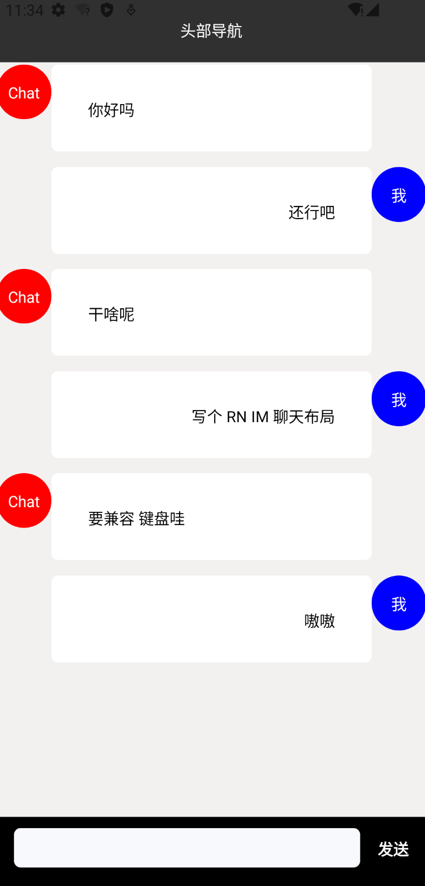
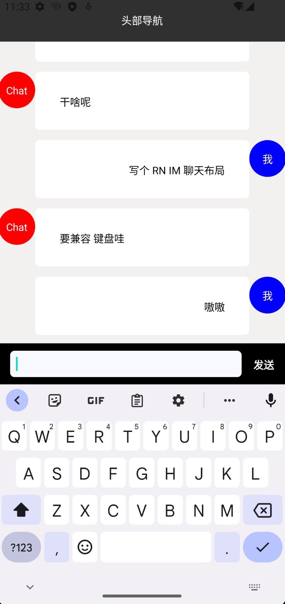

# 一个 rn-chat 页面 demo。 

### 特性： 
页眉页脚固定，中部自适应。
键盘弹起页面自适应

### Setup
1. 搭建 RN 环境，参考 https://www.reactnative.cn/docs/environment-setup
2. 
```shell
# clone 代码
git clone https://github.com/quliangen/rn-chat.git

# 安装依赖
yarn 

# 运行 开发服务
yarn dev
```

###
1. 默认视图
   


2. 键盘视图
   

